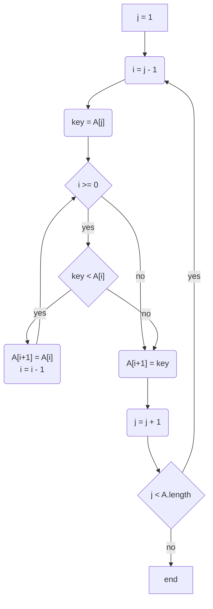

Complexity **0(n^2)**

Type: **incremental**

**in place**

Pseudocode

```mermaid
flowchart TD
  A[j = 1] --> B(i = j - 1)
  B --> C("key = A[j]")
  C --> D{i >= 0}
  D --> |yes| E{"key < A[i]"}
  E --> |yes| F("A[i+1] = A[i]<br>i = i - 1")
  F --> D
  D --> |no| G("A[i+1] = key")
  E --> |no| G
  G --> H(j = j + 1)
  H --> I{"j < A.length"}
  I --> |yes| B
  I --> |no| K[end]
```
